<!-- $theme: gaia -->
<!-- $size: 16:9 -->
<!-- footer: Adrien Leger - 2017 - creative commons license 4.0 by-nc-sa -->

<!-- template: invert -->

## ==Deciphering the lncRNA epitranscriptome==

##### Functional and structural interplay between 
##### long non-coding RNA, RNA modifications and proteins

# 

###### Adrien Leger EIPOD postdoctoral fellow
###### Enright Group EMBL-EBI /Marcia Group EMBL Grenoble 
###### aleg@ebi.ac.uk / [a-slide @github](https://github.com/a-slide)

---
<!-- page_number: true -->
<!-- template: invert -->

### ==The lncRNAs==
##### A poorly understood, awkward and rickety class of RNA

<small>

* Defined by convention; >200 nt RNA "without" ORF
* Only a small fraction have demonstrated regulatory functions
* Numerous competing human lncRNA classifications
* Usually expressed at low level compared with protein-coding

</small>

---
<!-- template: default -->
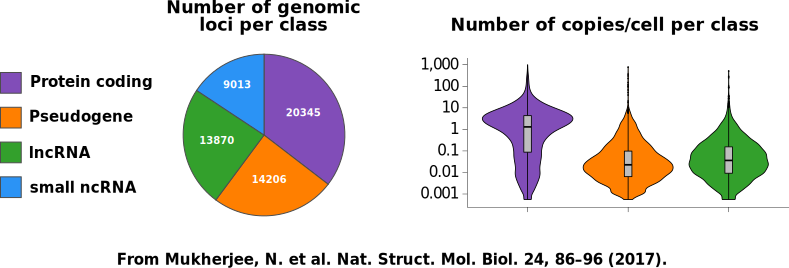
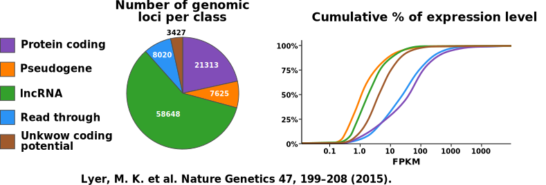

---

<!-- template: invert -->

##### ==lncRNAs localization and functions==

<small>

* Enriched in the nucleus :arrow_right:  Splicing + export + transcription ?
* Also found in cytosol :arrow_right:  Stability, miRNA sponge, translation ?
* Nucleolus, perinuclear, mitochondria ... ??

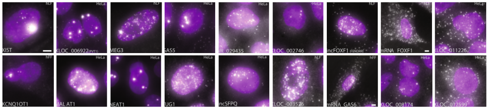

<small><small>

Cabili, M. N. et al. Localization and abundance analysis of human lncRNAs... Genome Biol 16, (2015).

</small></small>

</small>

---

<!-- template: default -->

### ==The lncRNAs==
##### Open questions

<small>

* What are their mechanisms of action and functional classification?
* How do they interact with other cellular actors?
<small> mRNAs, DNA, proteins ...</small> 
 
* Cell localization specific roles
<small> nucleus, nucleolus, cytosol, ribosome ...</small> 

</small>

---
<!-- template: default -->

### ==The Epitranscriptome==
##### Collection of all the RNA post-transcriptional modifications

<small>

* Highly conserved feature found in archaea, bacteria and eukarya
* More than 100 RNA known modifications

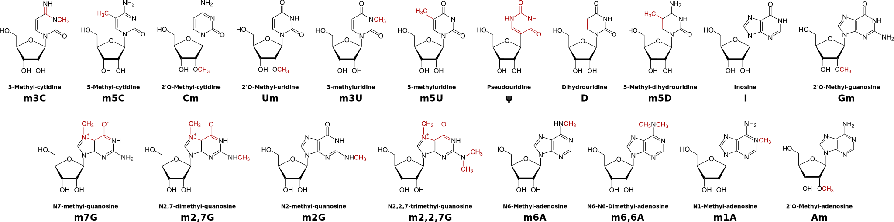

</small> 

---

<!-- template: invert -->

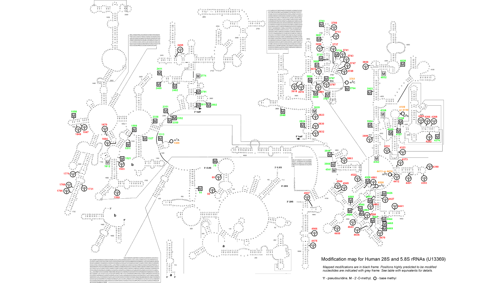

##### ==RNA modifications in rRNA and tRNA==

<small>

* Heavily modified
<small>

	* Many pseudouridines
	* Ribose 2'O methylation
	* Various bases methylation  

</small> 

* Participate in the RNA folding and stability 
* Modify ligand interactions particularly in the tRNA anticodon region 
* Impact on translational fidelity

</small>

---

<!-- template: default -->

##### ==RNA modifications in polyA+ RNAs: mRNAs and lncRNAs==
<small>

* Terminal modifications are well known
<small>

	* PolyA tailing +- Urydinylation
	* 5' capping with 7' Methylguanosine

</small> 

* Internal modifications recently described by NGS based methods
<small>

	* PTM IP + NGS = ==m6A, m1A, m6Am==
	* Chemical treatment + NGS = ==m5C, 5hmC, Pseudouridine==
	* Direct sequencing + Editing detection = ==Inosine==

</small> 

* Extensively found in mRNA with specific distribution pattern
* Functions diverse and complex :arrow_right: ==RNA structure + protein recruitment== 
* Writer, Eraser and Reader proteins found :arrow_right: ==Dynamic layer==
* m6A was described to be ==transcript specific== 

</small>

---

<!-- template: default -->

##### ==Overview of various mRNA PTM and their suggested functions==
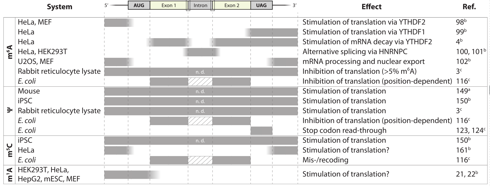

<small><small><small>

Hoernes, T. P. and Erlacher, M. D. Translating the epitranscriptome. Wiley Interdiscip Rev RNA (2016)

</small> </small> </small> 

---

<!-- template: invert -->

### ==The Epitranscriptome of lncRNAs==
##### Open questions
<small>

* All mRNA modifications also detected in lncRNAs
* Overall lower enrichment
* PTM functions mRNAs focussed on translation $\ne$ lncRNAs ?
* Relation with functional classification ?
* Relation with cell localization ?

</small>

---
<!-- template: invert -->

### ==lncRNAs, RNA localization and epitranscriptome==
##### Preliminary data mining
---
<!-- template: invert -->

##### ==lncRNA localization datasets==

<small>

* Collect ==lncRNA localization information==
* Re-analysis at transcript level with recent gene annotations

* High throughput RNA FISH of lncRNA 

<small><small>Cabili, M. N. et al. Localization and abundance analysis of human lncRNAs at single-cell and single-molecule resolution. Genome Biol 16, (2015)</small></small>

* Nucleus vs cytosol NGS data

<small><small>Djebali, S. et al. Landscape of transcription in human cells. Nature 489, 101–108 (2012).
ENCODE v2
</small></small>

[NOTEBOOK](http://www.ebi.ac.uk/~aleg/notebooks/2016_07_02_Epi2_pilot_datasets_analysis_localization.html)
</small>

---
<!-- template: default -->

##### ==lncRNA localization by RNA FISH==
<small>

* Human foreskin fibroblast (hFFs), Human lung fibroblast (hLFs) and HeLA cells
* 5 possible localization

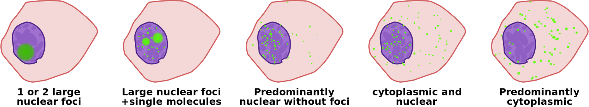

* 61 initial targets
* 34 valid targets after technical filters
* Discrepancy in annotation of the target genes
	

</small>

---
<!-- template: default -->

##### ==lncRNA localization by RNA FISH==
<small>

==2693== initial RNA probes
:arrow_down:

Blast against human transcriptome (gencode v24)
:arrow_down:

Filter out probe sets with multi-gene 
and protein-coding genes matches
:arrow_down:

==30== unambiguous lncRNA genes
==183== lncRNA transcripts 

==Low number of candidates but excellent control dataset==

</small>

---
<!-- template: default -->

##### ==lncRNA nuclear vs cytoplasmic localization by RNA-Seq==
<small>

<small><small>ENCODE v2 consortium (2012)</small></small>

* Many cell lines <small><small>(A549, GM12878, HeLa-S3, HepG2, HUVEC, IMR90, K562, MCF-7, NHEK and SK-N-SH)</small></small>
* Separation of Nuclear and Cytosol fractions <small><small>(Qiagen RLN buffer)</small></small>
* Extraction of Long PolyA+ RNA
* High depth RNA-seq

:arrow_right: High quality dataset

* Gene level analysis
* Only focused on protein-coding RNA

</small>

---
<!-- template: default -->

##### ==lncRNA nuclear vs cytoplasmic localization by RNA-Seq==

<small>

Raw RNA-Seq datasets
:arrow_down:

Transcript level alignment vs human transcriptome (gencode v24)
with *Kallisto*
:arrow_down:

Normalisation and differential expression analysis
Cytosol vs Nucleus fraction with *Sleuth*

==Quantitative data on relative enrichment in each fraction==
==Transcriptome wide but with complex normalization==

</small>

---
<!-- template: default -->

##### RNA relative enrichment in nucleus or cytosol

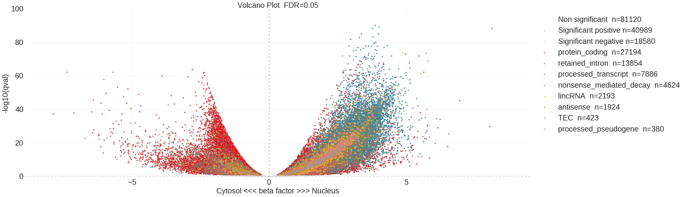
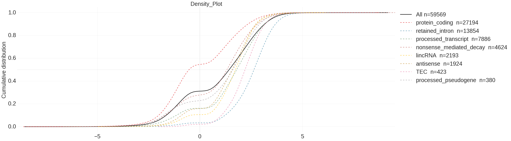

---
<!-- template: default -->

##### RNA relative enrichment and mean expression

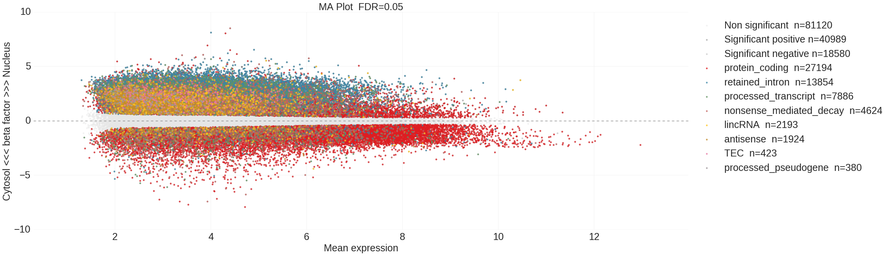
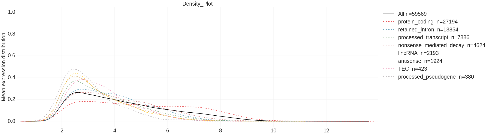

---
<!-- template: default -->

##### ==Comparison with the FISH Data==
<small>HeLa cell data FISH vs ENCODE HeLa-S3 datasets</small>

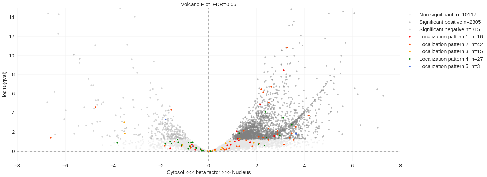

---
<!-- template: default -->

##### ==Why transcript level analysis matters==

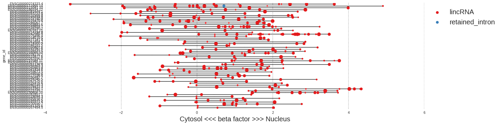
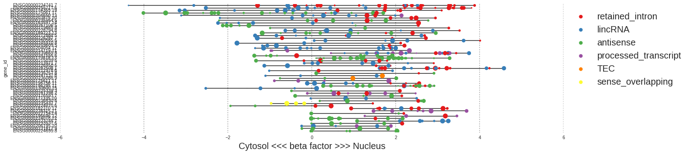

---
<!-- template: invert -->

### ==RNA PTM datasets== 

<small> <small> <small> 
| Source                                                 | RNA PTM           | Number of peaks |
|--------------------------------------------------------|-------------------|-----------------|
| Z Peng et al. Nat Biotechnol 30, 253-60 (2012)         | Inosine           | 21111           |
| M Sakurai et al. Genome Res 24, 522-34 (2014)          | Inosine           | 20482           |
| DARNED database                                        | Inosine           | 290002          |
| RADAR database                                         | Inosine           | 1342374         |
| D Dominissini et al. Nature 530, 441-6 (2016)          | m1A               | 19552           |
| S Hussain et al. Cell Rep 4, 255-61 (2013)             | m5C               | 1084            |
| V Khoddami et al. Nat Biotechnol 31, 458-64 (2013)     | m5C               | 20553           |
| JE Squires et al. Nucleic Acids Res 40, 5023-33 (2012) | m5C               | 10490           |
| D Dominissini et al. Nature 485, 201-6 (2012)          | m6A               | 2894            |
| KD Meyer et al. Cell 149, 1635-46 (2012)               | m6A               | 4341            |
| B Linder et al. Nat Methods 12, 767-72 (2015)          | m6A / m6Am        | 15167           |
| TM Carlile et al. Nature 515, 143-6 (2014)             | pseudourine       | 8               |
| X Li et al. Nat Chem Biol 11, 592-7 (2015)             | pseudourine       | 1489            |
| S Schwartz et al. Cell 159, 148-62 (2014)              | pseudourine       | 402             |

</small> </small> </small> 

---
<!-- template: default -->

##### ==Harmonisation and re-annotation of the datasets==

<small>

Collect raw peak coordinates
:arrow_down:

Transform to BED Standard format
:arrow_down:

Add metadata (Initial cell line, method, Pubmed ID)
:arrow_down:

Update coordinates to last version of human genome (HG38)
:arrow_down:

Annotate coordinates with overlapping genes
based on Gencode v24

[NOTEBOOK](http://www.ebi.ac.uk/~aleg/notebooks/2016_05_23_Epi2_pilot_datasets_analysis_PTM.html)
</small>

---
<!-- template: default -->

##### RNA modification sites found in lncRNA 
<small><small><small>
| Source             | RNA PTM           | Sites in annotated RNA | Sites in lncRNA | Unique lncRNA |
|--------------------|-------------------|------------------------|-----------------|---------------|
| Peng et al         | Inosine           | 17081                  | 3259            | 505           |
| Sakurai et al      | Inosine           | 17230                  | 2330            | 319           |
| DARNED             | Inosine           | 254964                 | 19814           | 1300          |
| RADAR              | Inosine           | 918049                 | 68396           | 3343          |
| Dominissini et al. | m1A               | 19063                  | 578             | 338           |
| Hussain et al      | m5C               | 296                    | 106             | 39            |
| Khoddami et al     | m5C               | 12011                  | 1523            | 36            |
| Squires et al.     | m5C               | 10169                  | 272             | 112           |
| Dominissini et al. | m6A               | 1019                   | 114             | 84            |
| Meyer et al        | m6A               | 4312                   | 48              | 16            |
| Linder et al       | m6A and m6Am      | 14851                  | 375             | 168           |
| Carlile et al      | pseudourydine | 7                      | 3               | 3             |
| Li et al           | pseudourydine | 1471                   | 47              | 44            |
| Schwartz et al     | pseudourydine | 372                    | 14              | 10            |
</small></small></small>

---
<!-- template: default -->

##### ==Cross-matching lncRNA localization and RNA modifications==

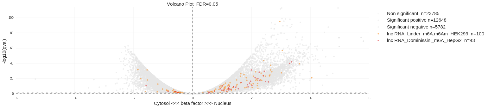
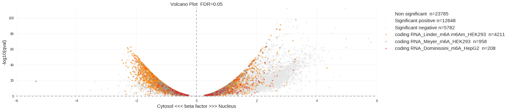

<small>

[NOTEBOOK](http://www.ebi.ac.uk/~aleg/notebooks/2016_05_23_Epi2_pilot_datasets_analysis_PTM.html)

</small>

---
<!-- template: default -->
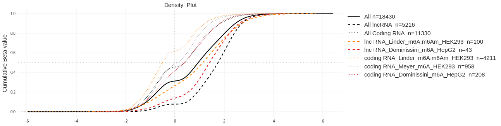
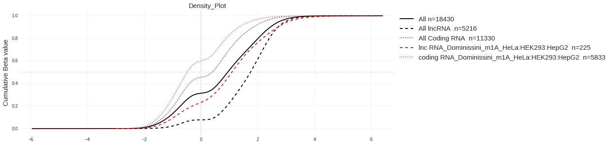

---
<!-- template: default -->

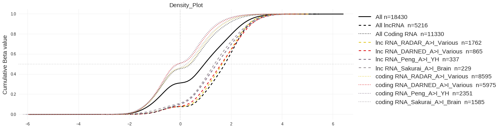
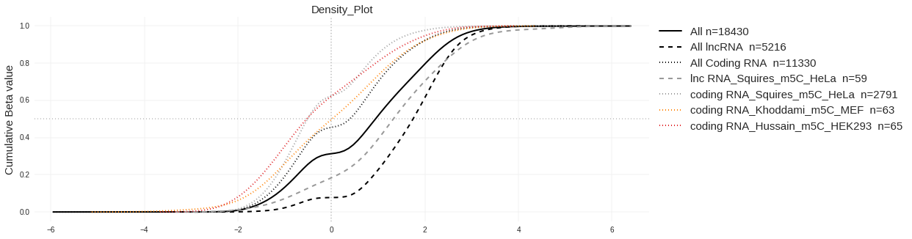

---
<!-- template: default -->

##### ==Conclusion on lncRNA==

<small>

* RNA modifications seem to be enriched in the cytosolic fraction
* Low expression of lncRNA :arrow_right: low sensitivity of detection  of modifications
* Competition with coding RNA :arrow_right: below sensitivity of methods

* Hard to have a real idea of PTM distribution
* What are the important modifications for lncRNA
* Need for targeted or more sensitive methods

</small>

---
<!-- template: invert -->

### ==Towards more sensitive methods for PTM analysis for low abundant RNA species==

---
<!-- template: invert -->

##### ==3 new complementary methods to detect RNA modifications==

<small>

1. Mass spectrometry of RNA nucleosides
<small>

Advantages : Cheap, Quick, Quantitative, Simultaneous detection of many PTM
Limits : No sequence information

</small>

2. PTM IP and lncRNA capture
<small>

Advantages : Based on existing sensitive methods
Limits : Only 1 modification at the time + no absolute comparison

</small>
3. Native detection of PTM by Nanopore direct RNA sequencing    
<small>

Advantages : Virtually no processing of samples, Many modifications 
Limits : Early time, Low accuracy, development time.

</small>
</small>

---
<!-- template: default -->

##### ==Detecting and quantifying RNA modifications by MS==

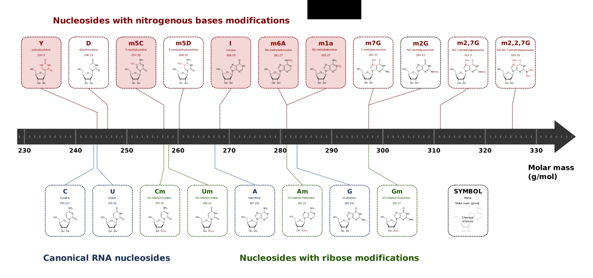

---
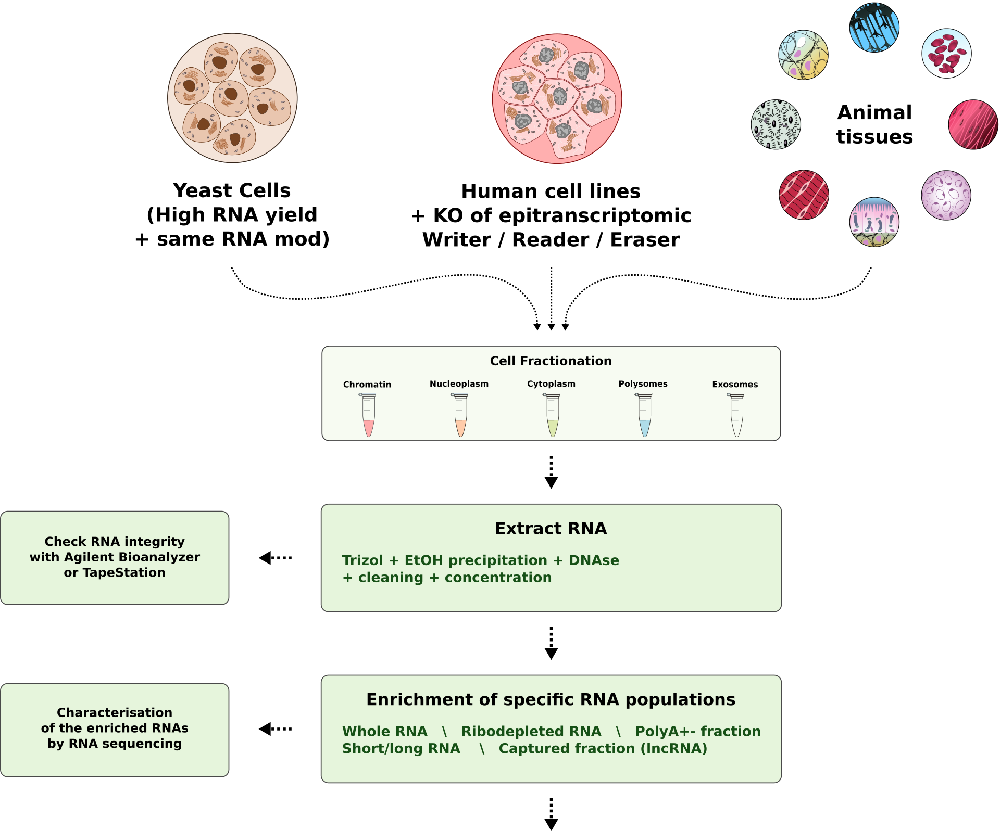

---
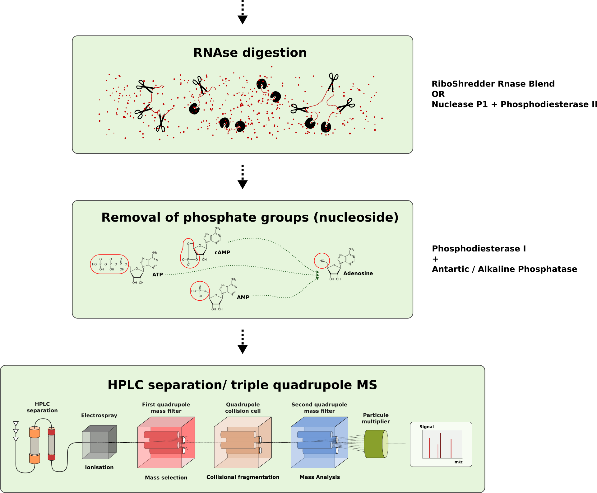

