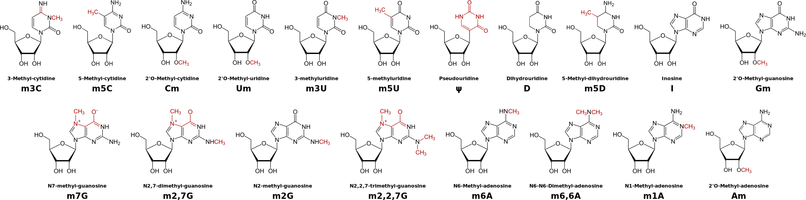

<!-- $theme: gaia -->
<!-- $size: 16:9 -->

<!-- template: invert -->

## ==Deciphering the long non-coding RNA epitranscriptome==

# 

###### Adrien Leger
###### EMBL Interdisciplinary postdoctoral fellowship 
###### Enright Group EMBL-EBI
###### aleg@ebi.ac.uk / [a-slide @github](https://github.com/a-slide)

---
<!-- page_number: true -->
<!-- template: default -->

### ==The long non-coding RNAs==
##### A poorly understood, awkward and rickety class of RNA

<small>

* Defined by convention :arrow_right: >200 nt RNA "without" ORF

* Only a small fraction have demonstrated regulatory functions
* Many seems to be involved in genetic diseases and cancers

</small>

---
<!-- template: default -->

### ==The Epitranscriptome==
##### Collection of all the RNA post-transcriptional modifications

<small>

* Highly conserved feature found in archaea, bacteria and eukarya
* More than 100 RNA known modifications

</small> 

---

<!-- template: default -->

##### ==RNA modifications in messenger RNAs==
<small>

* Terminal modifications are well known (3' pA tail + 5' cap)

* < 10 internal modifications recently described by NGS based methods

:arrow_right: ==RNA folding and structure==

:arrow_right: ==Additional chemical functionalities = Protein recruitment== 

:arrow_right: ==Dynamic layer = Writer, Eraser and Reader==

</small>

---

<!-- template: invert -->

##### ==Data-Mining the epitranscriptome of lncRNAs==
<small>

<small><small><small>
| Source             | RNA PTM           | Sites in annotated RNA | Sites in lncRNA | Unique lncRNA |
|--------------------|-------------------|------------------------|-----------------|---------------|
| Peng et al         | Inosine           | 17081                  | 3259            | 505           |
| Sakurai et al      | Inosine           | 17230                  | 2330            | 319           |
| DARNED             | Inosine           | 254964                 | 19814           | 1300          |
| RADAR              | Inosine           | 918049                 | 68396           | 3343          |
| Dominissini et al. | m1A               | 19063                  | 578             | 338           |
| Hussain et al      | m5C               | 296                    | 106             | 39            |
| Khoddami et al     | m5C               | 12011                  | 1523            | 36            |
| Squires et al.     | m5C               | 10169                  | 272             | 112           |
| Dominissini et al. | m6A               | 1019                   | 114             | 84            |
| Meyer et al        | m6A               | 4312                   | 48              | 16            |
| Linder et al       | m6A and m6Am      | 14851                  | 375             | 168           |
| Li et al           | pseudourydine | 1471                   | 47              | 44            |
| Schwartz et al     | pseudourydine | 372                    | 14              | 10            |
</small></small></small>

* All modifications found in mRNA are also in lncRNA
* Low expression of lncRNA :arrow_right: low sensitivity of detection  of modifications

</small>

---
<!-- template: invert -->

##### ==Towards more sensitive methods for PTM analysis for low abundant RNA species==

<small>

1. Mass spectrometry of RNA nucleosides
<small>

	==⊕== Cheap, quick, quantitative, simultaneous detection of many PTM
	==⊝== No sequence information

</small>

2. PTM IP and lncRNA capture
<small>

	==⊕== Based on existing sensitive methods
	==⊝== Only 1 modification at the time + no absolute comparison

</small>

3. Native detection of PTM by Nanopore direct RNA sequencing    
<small>

	==⊕== Virtually no processing of samples, many modifications 
	==⊝== Early days, low accuracy, development time.

</small>
</small>

